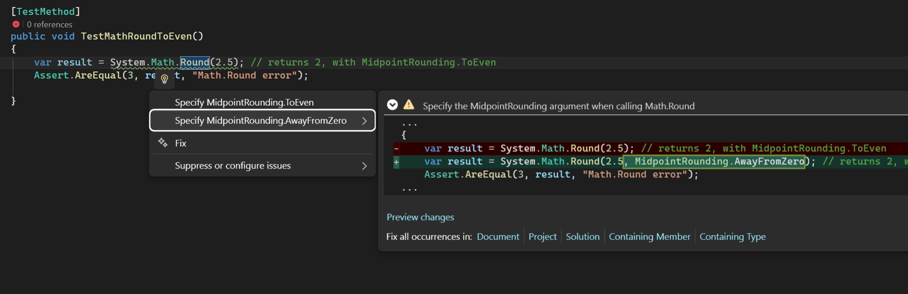

# Explicit Midpoint Rounding Analyzer

Roslyn analyzer that reports calls to `System.Math.Round`, `System.MathF.Round`,
and `System.Decimal.Round` when the overload omits an explicit
`MidpointRounding` argument.

`Math.Round` defaults to `MidpointRounding.ToEven`, which can be easy to miss in
code reviews. This analyzer is intentionally neutral: it only requires the
rounding mode to be stated explicitly.

## When this can go wrong

The default `Math.Round` behavior is `MidpointRounding.ToEven`, also known as
banker's rounding. That is a valid rounding strategy, but it can be surprising
when the code looks like ordinary "round halves up" logic.

```csharp
Math.Round(2.5); // 2, not 3
Math.Round(3.5); // 4
Math.Round(4.5); // 4, not 5
```

This is easy to overlook in user-facing or financial calculations:

```csharp
var displayedRating = Math.Round(rawRating);
var invoiceLineTotal = Math.Round(quantity * unitPrice, 2);
var taxAmount = Math.Round(netAmount * taxRate, 2);
```

If the intended policy is "round halves away from zero", the code should say so:

```csharp
var displayedRating = Math.Round(rawRating, MidpointRounding.AwayFromZero);
var invoiceLineTotal = Math.Round(quantity * unitPrice, 2, MidpointRounding.AwayFromZero);
var taxAmount = Math.Round(netAmount * taxRate, 2, MidpointRounding.AwayFromZero);
```

## Rule

`EMRA001` reports a warning for calls such as:

```csharp
Math.Round(value);
Math.Round(value, 2);
MathF.Round(floatValue);
decimal.Round(decimalValue);
System.Math.Round(value, 2);
```




Calls that already specify a rounding mode are ignored:

```csharp
Math.Round(value, MidpointRounding.ToEven);
Math.Round(value, 2, MidpointRounding.AwayFromZero);
```

If the intended policy is banker's rounding, make that explicit too:

```csharp
var invoiceLineTotal = Math.Round(quantity * unitPrice, 2, MidpointRounding.ToEven);
```

## Code fix

The code fix offers both explicit rounding modes:

```csharp
Math.Round(value);
// option 1
Math.Round(value, MidpointRounding.ToEven);

// option 2
Math.Round(value, MidpointRounding.AwayFromZero);
```

## Build 

To create the NuGet package locally:

```bash
dotnet pack src/ExplicitMidpointRoundingAnalyzer/ExplicitMidpointRoundingAnalyzer.csproj -c Release -o artifacts
```
